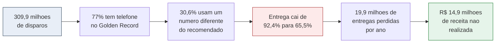
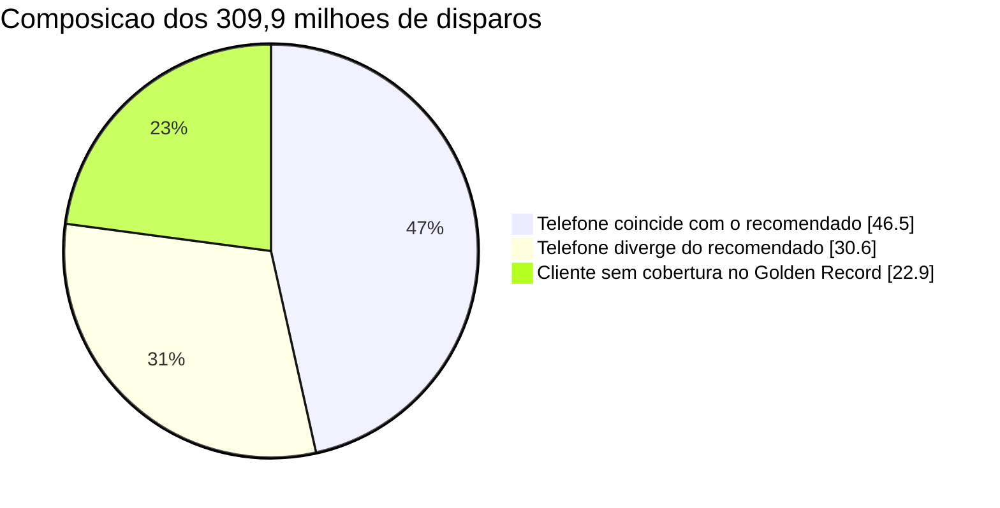
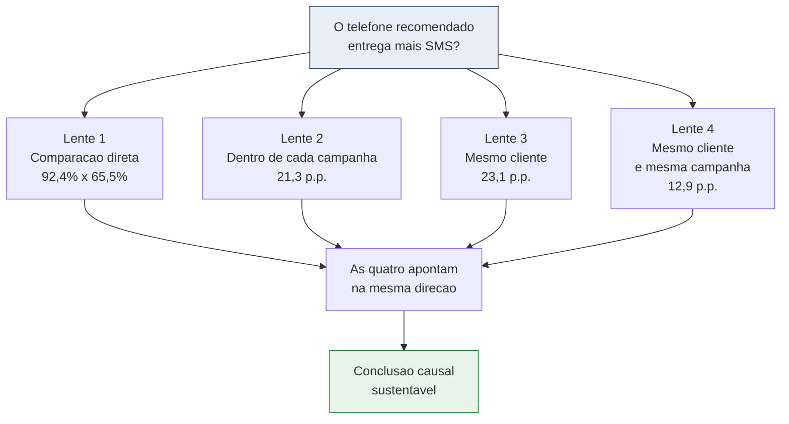
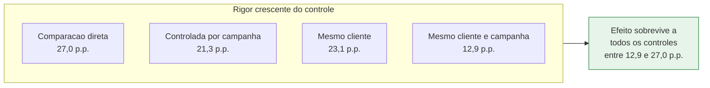
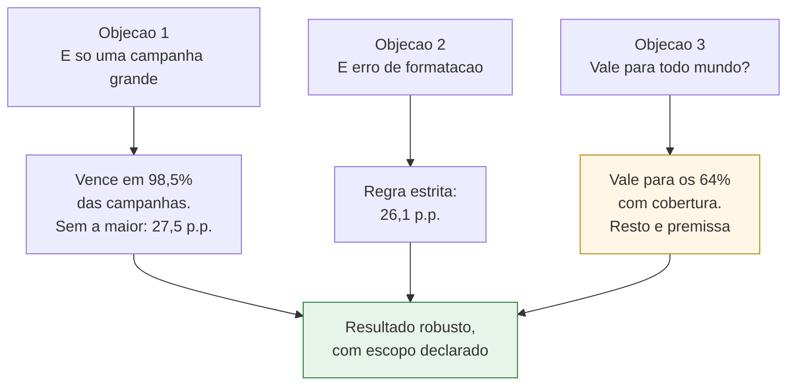
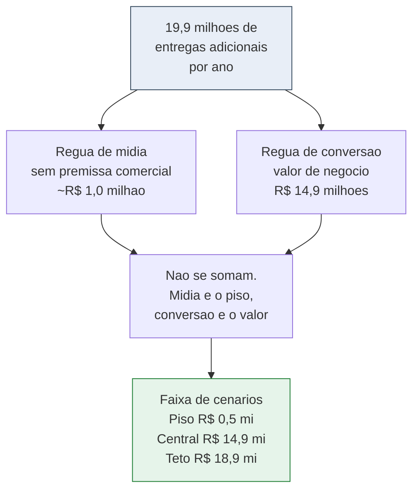
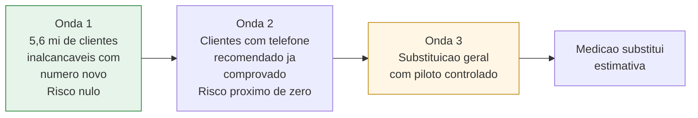

# Apresentação do estudo: valor do Golden Record de telefone

Material de apoio para montar a apresentação em PowerPoint a partir do arquivo `01_estudo_golden_record.sql`. Traz duas versões: uma página executiva única e uma apresentação de seis blocos, cada bloco com título de ação, subtítulo de ação, texto de apoio e a visualização sugerida em mermaid.

Os números usados são os da última execução completa. Ao rodar a versão atual do estudo, alguns indicadores novos passam a existir e os campos marcados como a apurar se preenchem sozinhos.

**Convenção dos títulos.** Título de ação é uma afirmação que já entrega a conclusão do slide. Subtítulo de ação é a evidência que sustenta a afirmação. Se o leitor ler apenas os títulos, na sequência, ele terá a história completa.

---

## Parte 1. Visão executiva de uma página

### Título de ação
Usar o telefone do Golden Record eleva a entrega de SMS em 21 pontos percentuais e libera cerca de R$ 14,9 milhões por ano em receita hoje perdida.

### Subtítulo de ação
Quatro métodos estatísticos independentes chegam ao mesmo resultado, o efeito aparece em 98,5% das campanhas, e a estimativa mais conservadora, que não assume nada, ainda é positiva.

### O quadro em quatro frases

**A oportunidade existe e é grande.** O Golden Record cobre 77% dos disparos. Em 30,6% deles a base indicaria um telefone diferente do que o CRM usa hoje, e entre os SMS que falharam essa divergência sobe para 66,8%.

**O telefone certo entrega muito mais.** Disparos que coincidem com o telefone recomendado entregam 92,4%, contra 65,5% dos demais. Controlando por campanha, a vantagem é de 21,3 pontos percentuais, com chance de acaso praticamente nula.

**Não é coincidência nem artefato.** O efeito se mantém no mesmo cliente comparado consigo mesmo, resiste à exclusão da maior campanha, resiste à regra estrita de comparação de números e aparece em 98,5% das campanhas testadas.

**O valor é material e tem piso.** Hoje R$ 2,28 milhões são gastos com SMS que não chegam. A adoção recupera cerca de 19,9 milhões de entregas por ano, o equivalente a R$ 14,9 milhões em receita. Mesmo o cenário que só conta o já comprovado, sem nenhuma projeção, permanece positivo.

### Números de cabeceira

| Indicador | Valor |
|---|---|
| Disparos analisados | 309,9 milhões |
| Entrega com telefone do Golden Record | 92,4% |
| Entrega com outro telefone | 65,5% |
| Vantagem controlada por campanha | 21,3 p.p. |
| Campanhas em que o Golden Record venceu | 98,5% |
| Custo atual em disparos que não chegam | R$ 2,28 milhões |
| Receita incremental, cenário central | R$ 14,9 milhões |
| Clientes hoje inalcançáveis com telefone novo | 5,6 milhões |

### Visual da página única

### Pedido de decisão
Aprovar a adoção do telefone de ranking 1 do Golden Record como fonte primária de contato nas campanhas de SMS, começando pelos 5,6 milhões de clientes hoje inalcançáveis para os quais existe um número ainda não testado.

---

## Parte 2. Apresentação de seis blocos

### Bloco 1. Contexto e oportunidade

**Título de ação**
Um em cada três disparos vai para um telefone que o Golden Record não recomendaria.

**Subtítulo de ação**
E entre os SMS que não chegam, essa proporção dobra: dois em cada três teriam ido para outro número.

**Texto de apoio**

O estudo analisou 309,9 milhões de disparos de SMS, distribuídos por mais de mil campanhas. Para 77% desses disparos existe um telefone cadastrado no Golden Record, o que define o alcance máximo de qualquer iniciativa baseada nessa fonte.

Dentro do universo coberto, o CRM já acerta o telefone recomendado em quase 70% das vezes, sem usar a base. A oportunidade está nos 30,6% restantes, e ela se concentra justamente onde dói: entre os disparos que falharam, 66,8% teriam usado um número diferente.

Esse contraste é o primeiro sinal de que a divergência de telefone e a falha de entrega andam juntas.

**Visual**

---

### Bloco 2. O desenho do experimento

**Título de ação**
Sem poder fazer um teste A/B, montamos um experimento natural que o próprio histórico já rodou.

**Subtítulo de ação**
O Golden Record nasce de fontes que não alimentam o CRM, então a coincidência de telefone funciona como um sorteio involuntário.

**Texto de apoio**

A pergunta é causal: o telefone recomendado entrega mais? Responder com rigor exigiria sortear clientes e enviar por caminhos diferentes, o que não estava disponível.

A saída foi reconhecer que a coincidência entre o telefone do CRM e o do Golden Record acontece por sobreposição de cadastros construídos de forma independente. Ninguém escolheu esses grupos olhando para o resultado do disparo, e é isso que aproxima a comparação de um experimento.

A ressalva honesta é que clientes cujos telefones coincidem entre fontes podem ter cadastro mais estável. Por isso a mesma pergunta foi respondida por quatro caminhos que controlam coisas diferentes. Se os quatro apontarem na mesma direção, a explicação alternativa precisa sobreviver a todos ao mesmo tempo.

**Visual**

---

### Bloco 3. A evidência

**Título de ação**
O telefone recomendado entrega 21 pontos percentuais a mais, mesmo depois de neutralizar as diferenças entre campanhas.

**Subtítulo de ação**
A chance de esse resultado ser acaso é menor que uma em um milhão, e ele se repete quando comparamos cada cliente consigo mesmo.

**Texto de apoio**

A comparação direta mostra 92,4% de entrega no telefone recomendado contra 65,5% nos demais, uma diferença bruta de 27 pontos percentuais.

Campanhas diferentes têm públicos e patamares de entrega diferentes, então a comparação foi refeita dentro de cada uma das campanhas e depois combinada, ponderando pelo tamanho. A vantagem cai para 21,3 pontos percentuais e permanece estatisticamente sólida. Esse é o número que deve ser levado para decisão.

O teste mais intuitivo compara o mesmo cliente consigo mesmo, em momentos em que ele recebeu SMS nos dois telefones. Como é a mesma pessoa, região, perfil e engajamento são idênticos nos dois lados, e o que resta é o número. A vantagem é de 23,1 pontos percentuais.

A versão mais rigorosa exige mesmo cliente e mesma campanha, deixando apenas o telefone variar. A vantagem cai para 12,9 pontos percentuais, valor menor e esperado, porque esse recorte remove também o efeito do tempo entre campanhas. Continua positivo e significante.

**Visual**

---

### Bloco 4. A robustez

**Título de ação**
Três tentativas de derrubar o resultado falharam, e o efeito aparece em 98,5% das campanhas.

**Subtítulo de ação**
Não é uma campanha atípica, não é erro de formatação de número e não é um perfil específico de cliente.

**Texto de apoio**

A primeira objeção previsível é que uma campanha gigante estaria puxando a média. O teste do sinal ignora o tamanho e conta apenas em quantas campanhas o telefone recomendado venceu: 98,5% delas. Excluir a maior campanha da base mantém a vantagem em 27,5 pontos percentuais.

A segunda objeção é que a diferença seria artefato da regra que despreza o nono dígito e o código do país. Refazendo a comparação com igualdade estrita, caractere por caractere, a vantagem fica em 26,1 pontos percentuais, praticamente igual.

A terceira é sobre a validade externa. Clientes com cobertura do Golden Record já entregam 11,1 pontos percentuais melhor que os sem cobertura, mesmo antes de olhar qual telefone foi usado. Isso não invalida o efeito, mas delimita o alcance: a conclusão vale com segurança para os 64% de clientes cobertos, e estendê-la ao restante é premissa declarada, não medição.

**Visual**

---

### Bloco 5. O valor

**Título de ação**
A adoção vale cerca de R$ 14,9 milhões por ano, e mesmo o cenário mais conservador continua positivo.

**Subtítulo de ação**
Duas réguas independentes chegam a números da mesma família: a de mídia, que não assume nada, e a de conversão, que traduz em receita.

**Texto de apoio**

Hoje R$ 2,28 milhões são gastos com SMS que não chegam ao destino. O disparo custa R$ 0,04, mas cada entrega efetiva custa cerca de R$ 0,049, porque o desperdício está embutido no preço real.

A primeira régua olha só para mídia e não depende de nenhuma premissa comercial. Alcançar o cliente pelo telefone recomendado custa cerca de R$ 0,043 por entrega, contra R$ 0,061 pelo número errado, cerca de 41% mais caro. As entregas adicionais que o Golden Record produz equivalem a aproximadamente R$ 1 milhão em mídia que não precisaria ser comprada.

A segunda régua traduz as mesmas entregas em receita. São cerca de 19,9 milhões de entregas adicionais por ano, ou 8,3 pontos percentuais de entrega, o que equivale a R$ 14,9 milhões no cenário central. Cada ponto percentual de entrega vale aproximadamente R$ 1,8 milhão.

As duas réguas não se somam, porque medem o mesmo ganho de formas diferentes. A de mídia é o piso incontestável, a de conversão é o valor de negócio.

Sobre a faixa de cenários: o teto assume que todo insucesso com telefone divergente viraria entrega, o que nenhum canal alcança, e serve apenas como limite lógico. O piso conta apenas os casos em que o telefone recomendado já foi acionado para aquele cliente e comprovadamente entregou, sem projetar nada, e permanece positivo.

Há um cenário que fica negativo e precisa de explicação, porque ele aparece na tabela. O cenário de evidência extrapolada mede a taxa de entrega do telefone recomendado apenas entre clientes em que esse número já foi acionado alguma vez, e projeta essa taxa para todos. Esse subgrupo não é neutro: são justamente os clientes para os quais a operação já precisou tentar mais de um número, ou seja, os mais difíceis de alcançar. A taxa medida ali é baixa, e ao aplicá-la a toda a base as recuperações encolhem enquanto as perdas incham. O número negativo descreve o subgrupo difícil, não o desempenho esperado do Golden Record. Ele fica na tabela como teste de estresse, não como previsão.

**Visual**

---

### Bloco 6. A decisão e os próximos passos

**Título de ação**
Recomendamos adotar o telefone recomendado como fonte primária, começando pelo público de risco zero.

**Subtítulo de ação**
Existem 5,6 milhões de clientes hoje inalcançáveis com um número ainda não testado, e um grupo onde o telefone recomendado já provou que entrega.

**Texto de apoio**

A adoção não precisa ser total desde o primeiro dia. A sequência sugerida reduz risco e produz evidência própria rapidamente.

A primeira onda são os clientes que hoje não recebem SMS em nenhum número e para os quais o Golden Record aponta um telefone ainda não acionado. São 5,6 milhões de pessoas e o risco é nulo, porque não há entrega a perder.

A segunda onda são os clientes com insucesso em um número e entrega já comprovada no telefone recomendado. Também aqui o risco de troca é próximo de zero, porque o número alternativo já provou funcionar para aquela pessoa.

A terceira onda é a substituição geral, e é a única que justifica um teste controlado. Um piloto em uma fatia de uma campanha grande valida a taxa de calibração usada no cenário central e substitui estimativa por medição.

Duas melhorias de dado aumentariam bastante a precisão do estudo. A primeira é registrar a data de envio na base de campanhas, o que permitiria garantir que o telefone recomendado já existia quando o disparo aconteceu. A segunda é expor a prioridade real do telefone no cadastro de origem, o que hoje precisa ser inferida e é a única limitação relevante do estudo complementar sobre ordem de acionamento.

**Visual**

---

## Parte 3. Notas para quem vai montar os slides

**Ordem de leitura dos títulos.** Lidos em sequência, os seis títulos de ação contam a história inteira: existe oportunidade, o desenho é confiável, a evidência é forte, ela resiste a ataques, o valor é material, e há um caminho de adoção com risco controlado.

**O que colocar em anexo, não no corpo.** Intervalos de confiança, valores de p, razão de chances, tamanho de cada braço e a tabela por campanha. Executivos pedem essas informações quando questionam, e tê-las prontas em anexo é melhor do que ocupá-los no fluxo principal.

**Como responder à pergunta mais provável.** A pergunta que costuma vir é se o resultado não seria apenas o reflexo de clientes melhores. A resposta em uma frase: comparando cada cliente consigo mesmo, com o mesmo perfil dos dois lados, a vantagem permanece em 23 pontos percentuais.

**Como tratar o cenário negativo se alguém apontá-lo.** Ele mede o subgrupo mais difícil da base e serve como teste de estresse. Está na tabela por transparência. O número de decisão é o cenário central, e o piso, que não projeta nada, continua positivo.

**Fonte de cada número.** Todos os indicadores citados saem da consulta única do arquivo `01_estudo_golden_record.sql`, e cada linha do resultado traz a view de origem, para auditoria.
