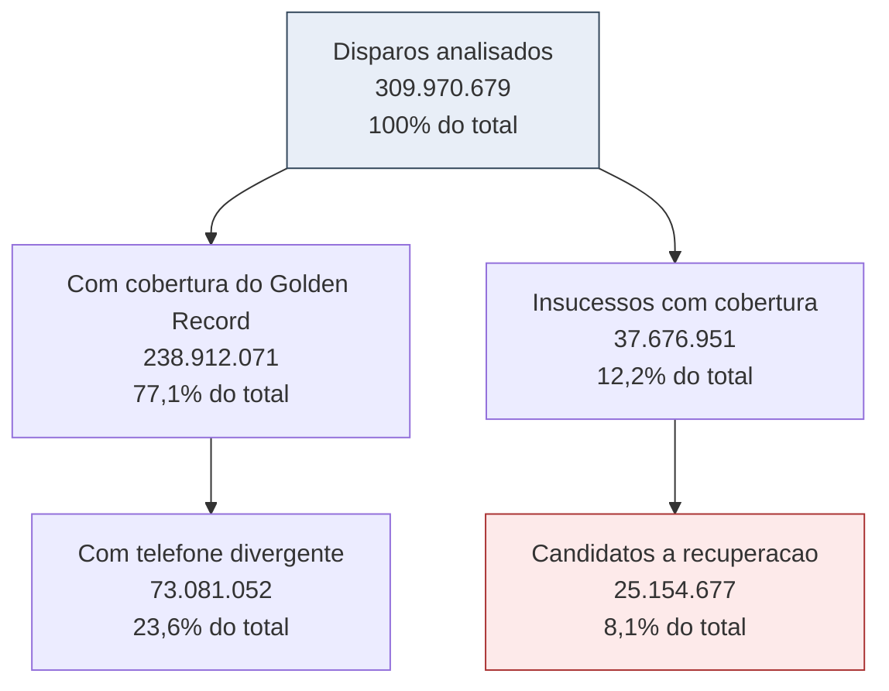
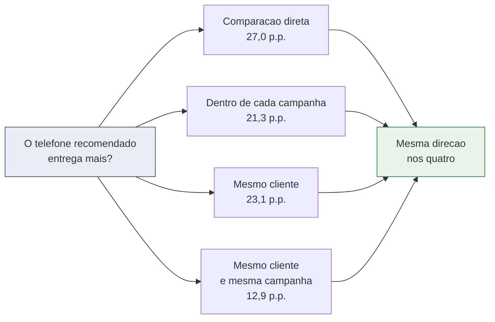
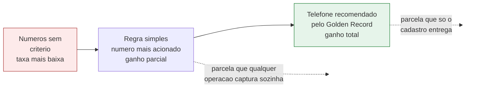
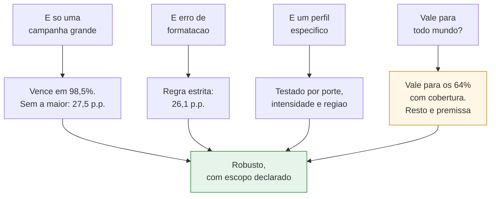
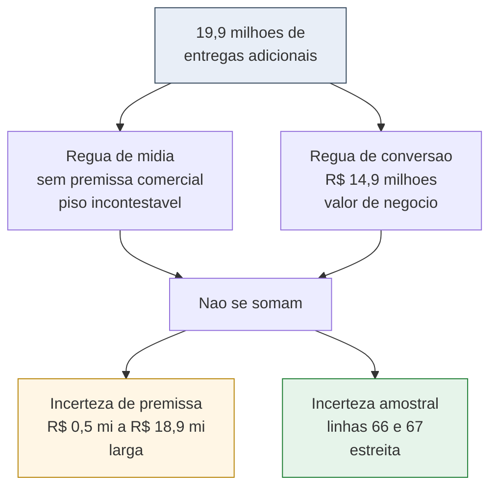
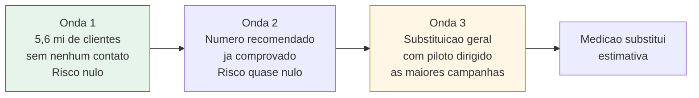

# Apresentação do estudo: valor do Golden Record de telefone

Material para montar a apresentação a partir de `01_estudo_golden_record.sql`. Duas versões: uma página executiva e uma sequência de seis blocos.

**Sobre os números.** Os valores em negrito vêm da execução de 2026-09-09, feita antes de dois filtros que passaram a existir no estudo: a exclusão das mensagens recebidas dos clientes e a restrição ao ano de 2025. Eles servem como ordem de grandeza e devem ser substituídos pelos números da próxima execução. Os campos entre colchetes correspondem a indicadores criados depois daquela execução.

**O período agora é conhecido, e isso muda a leitura do valor.** O estudo passou a filtrar a origem das campanhas pelo ano de 2025, usando a data de ingestão do registro de disparo. Com a janela fechada em doze meses, os valores de receita e de custo são leitura anual, e a linha 83 do relatório declara explicitamente o intervalo coberto. A versão anterior deste documento pedia para nunca dizer "por ano", porque a janela era desconhecida. Essa restrição não vale mais.

**Um filtro que melhora a qualidade da taxa de entrega.** As mensagens recebidas dos clientes, que são respostas e não disparos, ficaram de fora. Sem esse filtro elas entrariam no denominador e distorceriam a taxa de entrega para cima.

---

## Parte 1. Uma página

### O pedido
Aprovar o telefone de ranking 1 do Golden Record como fonte primária de contato nas campanhas de SMS, com adoção em três ondas e piloto medido na terceira.

### A razão em um número
Em 2025, disparos que coincidiram com o telefone recomendado entregaram **92,4%**, contra **65,5%** dos demais. Controlando por campanha, a vantagem é de **21,3 pontos percentuais**.

### As três coisas que sustentam a decisão

**A evidência não depende de um único método.** Comparação direta, controle por campanha, mesmo cliente comparado consigo mesmo e mesmo cliente na mesma campanha produzem efeitos entre **12,9 e 27,0 pontos percentuais**, todos na mesma direção, com chance de acaso desprezível.

**O efeito não é de uma campanha nem de um perfil.** O telefone recomendado venceu em **98,5%** das campanhas testadas. Excluir a maior campanha mantém o efeito em **27,5 pontos**. A regra estrita de comparação de números mantém em **26,1**.

**O valor tem piso, e o piso é positivo.** Mesmo o cenário que só conta casos já comprovados, sem projetar nada, permanece positivo.

### Os cinco números da decisão

| | Valor |
|---|---|
| Investimento anual em disparos que não chegam | **R$ 2,28 milhões** |
| Entregas adicionais estimadas por ano, cenário central | **19,9 milhões** |
| Receita incremental anual, cenário central | **R$ 14,9 milhões** |
| Faixa entre o cenário mais conservador e o teto | **R$ 0,5 mi a R$ 18,9 mi** |
| Clientes hoje sem nenhum contato, com número novo disponível | **5,6 milhões** |

### O risco, e o que fazemos com ele
A adoção substitui números que hoje funcionam, e uma fração dessas entregas se perderia. Todos os cenários já descontam essa perda. As duas primeiras ondas de adoção foram desenhadas para ter risco próximo de zero, porque atacam clientes sem nenhuma entrega ou clientes cujo número recomendado já provou funcionar.

### Como saberemos que funcionou
A terceira onda inclui um piloto controlado em uma fatia de campanha grande. O critério de sucesso é a taxa de entrega do braço com Golden Record superar o braço atual em pelo menos a metade do efeito estimado.

---

## Parte 2. Seis blocos

### Bloco 1. A oportunidade

**Título de ação**
Oito por cento de todo o volume de SMS são disparos que falharam e teriam ido para outro número.

**Subtítulo de ação**
O funil parte de 310 milhões de disparos e fecha em 25 milhões de casos que o Golden Record poderia ter mudado.

**Texto de apoio**

O estudo analisou **309,9 milhões** de disparos em mais de mil campanhas. O Golden Record tem telefone cadastrado para **77,1%** desse volume, o que define o alcance máximo de qualquer iniciativa baseada nessa fonte.

Dentro do universo coberto, o CRM já usa o telefone recomendado em cerca de sete de cada dez disparos, sem consultar a base. A oportunidade está no restante.

Uma observação de leitura que vale trazer ao slide: os percentuais do funil têm denominadores diferentes. A cobertura incide sobre todos os disparos, a divergência de telefone incide só sobre os disparos com cobertura, e a divergência nos insucessos incide só sobre os insucessos com cobertura. Por isso o número que parece maior, dois terços dos insucessos, é na verdade **8,1%** do volume total. O relatório traz as duas leituras lado a lado.

**Visual**

---

### Bloco 2. Por que acreditar no número

**Título de ação**
Sem poder sortear clientes, usamos um sorteio que o próprio histórico já fez.

**Subtítulo de ação**
Quatro métodos que controlam coisas diferentes chegam à mesma conclusão, e a explicação alternativa teria que sobreviver aos quatro.

**Texto de apoio**

A pergunta é causal e exigiria um teste A/B. A saída foi reconhecer que a coincidência entre o telefone do CRM e o do Golden Record acontece por sobreposição de cadastros construídos de forma independente. Ninguém escolheu esses grupos olhando o resultado do disparo.

A objeção previsível é que clientes cujos telefones coincidem entre fontes teriam cadastro mais estável e seriam mais fáceis de alcançar por outro motivo. Ela foi atacada em quatro frentes.

Comparar dentro de cada campanha neutraliza período, mensagem e público. Comparar o mesmo cliente consigo mesmo neutraliza perfil, região e engajamento, porque é a mesma pessoa dos dois lados. Exigir mesma pessoa e mesma campanha ao mesmo tempo é o desenho mais próximo de um experimento controlado que a base permite. O valor menor nesse último recorte é esperado, porque ele também remove o efeito de tempo entre campanhas.

**Visual**

---

### Bloco 3. Não é qualquer regra simples

**Título de ação**
O ganho vem do cadastro, e não apenas de deixar de usar números ruins.

**Subtítulo de ação**
Comparado à melhor heurística gratuita disponível, usar o telefone mais acionado pelo próprio CRM, o Golden Record ainda entrega mais.

**Texto de apoio**

Esta é a objeção mais dura que o estudo pode receber, e vale antecipá-la em vez de esperar a pergunta. Se qualquer regra razoável produzisse o mesmo efeito, o investimento em cadastro não se justificaria.

O comparativo escolhido é o telefone que o próprio CRM mais aciona para aquele cliente. É a alternativa que qualquer operação consegue adotar sem investir um centavo em enriquecimento de dados.

O estudo separa os disparos em três grupos e compara as três taxas de entrega: o número recomendado pelo Golden Record, o número mais acionado quando ele difere do recomendado, e os demais. A diferença entre o primeiro e o segundo é a parcela do efeito que só o cadastro entrega.

Ganho do Golden Record sobre a regra simples: **[preencher com a linha 18 do relatório]** pontos percentuais. Parcela do efeito atribuível ao cadastro: **[linha 18, campo de exemplo]**.

**Visual**

---

### Bloco 4. O efeito se repete em todo lugar

**Título de ação**
Nenhuma das quatro tentativas de derrubar o resultado funcionou.

**Subtítulo de ação**
Campanha grande, formatação de número, perfil de cliente e região foram testados um a um.

**Texto de apoio**

O telefone recomendado venceu em **98,5%** das campanhas com volume suficiente para teste individual. Excluir a maior campanha da base mantém o efeito em **27,5 pontos percentuais**.

Refazer a comparação exigindo igualdade estrita entre os números, sem tolerar diferença de nono dígito ou código de país, mantém em **26,1 pontos**. A conclusão não é artefato da regra de comparação.

O relatório atual acrescenta três segmentações que a versão anterior não tinha: efeito por porte de campanha, efeito por intensidade de contato do cliente e efeito por região. A leitura relevante não é a média, é a amplitude. Se o menor efeito entre os segmentos ainda for positivo e material, a adoção pode ser generalizada. Se houver segmento muito acima dos demais, ele vira prioridade de rollout.

Uma ressalva que precisa estar no slide, não no anexo: clientes com cobertura do Golden Record já entregam **11,1 pontos percentuais** melhor que os sem cobertura, mesmo antes de olhar o telefone. Isso não invalida o efeito, mas delimita o alcance. A conclusão vale com segurança para os **64%** de clientes cobertos, e estendê-la ao restante é premissa declarada.

**Visual**

---

### Bloco 5. Quanto vale, e o que ainda é incerto

**Título de ação**
O valor central é de R$ 14,9 milhões por ano, e a dúvida relevante é de premissa, não de dados.

**Subtítulo de ação**
Duas réguas independentes e dois tipos de incerteza, apresentados separadamente.

**Texto de apoio**

Hoje **R$ 2,28 milhões** são gastos com SMS que não chegam. O disparo custa quatro centavos, mas cada entrega efetiva custa cerca de cinco, porque o desperdício está embutido no preço real.

A primeira régua não assume nada sobre negócio. Alcançar o cliente pelo telefone recomendado custa cerca de **R$ 0,043** por entrega contra **R$ 0,061** pelo número errado, cerca de **41%** mais caro. As entregas adicionais valem, em mídia, o que custaria comprá-las hoje.

A segunda régua traduz as mesmas entregas em receita, usando taxa de conversão e ticket. São cerca de **19,9 milhões** de entregas adicionais, ou **8,3 pontos percentuais**, equivalentes a **R$ 14,9 milhões**. Cada ponto percentual de entrega vale aproximadamente **R$ 1,8 milhão**.

As duas réguas não se somam. Medem o mesmo ganho por critérios diferentes. A de mídia é o piso incontestável, a de conversão é o valor de negócio.

Sobre incerteza, o relatório agora separa duas coisas que costumam ser confundidas. A faixa de cenários, de **R$ 0,5 mi a R$ 18,9 mi**, é incerteza de premissa: ela varia a suposição sobre como o telefone recomendado se comportaria nos casos que falharam. A faixa estatística, nas linhas 66 e 67, é incerteza amostral: dado o volume observado, qual a margem de erro da própria medição. Com 310 milhões de disparos, a segunda é estreita. A discussão honesta é sobre premissa, não sobre tamanho de amostra.

Um cenário fica negativo e é melhor explicá-lo antes que perguntem. O cenário de evidência extrapolada mede a taxa do telefone recomendado apenas entre clientes em que ele já foi acionado, e projeta essa taxa para todos. Esse subgrupo é justamente o dos clientes para os quais a operação já precisou tentar mais de um número, ou seja, os mais difíceis. O número descreve o subgrupo difícil, não o desempenho esperado da base. Ele fica no relatório como teste de estresse.

**Visual**

---

### Bloco 6. Como adotar sem correr risco

**Título de ação**
Começar pelo público de risco zero e só depois generalizar, com piloto medido.

**Subtítulo de ação**
As duas primeiras ondas não têm entrega a perder, e a concentração do ganho indica por onde começar.

**Texto de apoio**

A adoção não precisa ser total no primeiro dia. A sequência abaixo reduz risco e produz evidência própria rapidamente.

A primeira onda são os **5,6 milhões** de clientes que hoje não recebem SMS em nenhum número e para os quais o Golden Record aponta um telefone ainda não acionado. O risco é nulo, porque não há entrega a perder.

A segunda onda são os clientes com insucesso em um número e entrega já comprovada no telefone recomendado. O risco continua próximo de zero, porque o número alternativo já provou funcionar para aquela pessoa.

A terceira onda é a substituição geral. O relatório agora informa quantas campanhas concentram metade do ganho, o que permite dirigir o piloto às campanhas de maior retorno em vez de sortear. Junto vem o esforço: quantos cadastros precisariam ser atualizados no CRM, número que até então não aparecia no valuation.

Uma melhoria de dado ainda pendente aumentaria a precisão do estudo complementar: expor a prioridade real do telefone no cadastro de origem removeria a única inferência relevante da análise de ordem de acionamento.

A ressalva temporal, que era a principal limitação do desenho, deixou de ser um pedido de dado e virou um indicador. Com a data do registro de disparo disponível, a linha 84 mede em que fração dos casos a recomendação do Golden Record já existia quando a campanha ocorreu, e a linha 85 recalcula o efeito apenas sobre esses casos. Se as duas linhas confirmarem o efeito, a objeção mais técnica ao estudo se fecha com dado, e não com argumento.

**Visual**

---

## Parte 3. Notas de montagem

**O arco dos títulos.** Lidos em sequência, os seis títulos contam a história sozinhos: existe oportunidade, o número é confiável, não é qualquer heurística, resiste a ataques, vale isto com esta incerteza, e há um caminho de adoção sem risco.

**O que vai para anexo.** Intervalos de confiança, valores de p, razão de chances, volume de cada braço, tabela por campanha, quartis do efeito e dispersão regional. Tenha à mão, não no fluxo principal.

**As três perguntas mais prováveis, com resposta curta.**

Não seria só reflexo de clientes melhores? Comparando cada cliente consigo mesmo, com o mesmo perfil dos dois lados, a vantagem permanece em vinte e três pontos percentuais.

Qualquer regra simples não daria o mesmo resultado? Não. O bloco 3 compara com a melhor heurística gratuita e o Golden Record ainda ganha.

Por que um dos cenários é negativo? Ele mede o subgrupo mais difícil da base e está no relatório como teste de estresse. O número de decisão é o cenário central, e o piso, que não projeta nada, é positivo.

**O que confirmar antes de apresentar.** Que a linha 83 mostra os doze meses de 2025 e que a linha 84 indica alta fração de recomendações anteriores ao disparo. Com as duas confirmadas, o valor pode ser apresentado como anual e a ressalva temporal pode ser tratada como resolvida.

**Rastreabilidade.** Todo indicador citado sai da consulta única de `01_estudo_golden_record.sql`, e cada linha do resultado traz a view de origem, a definição, o cálculo e a base de cálculo.
