# Golden Record de telefone: um em cada cinco SMS não chega, e o dado para corrigir isso já existe

Material para a apresentação ao board. Duas versões: um sumário executivo de uma página e uma sequência de nove slides. Ao final, o apêndice com a fonte de cada número, as premissas usadas nas projeções e as notas de montagem.

**Base dos números.** Execução do estudo sobre toda a operação de SMS de janeiro a agosto de 2026: 122 milhões de disparos, 1.683 campanhas, 41 milhões de clientes. A leitura de receita usa os 21 briefings promocionais com taxa de conversão e tíquete informados; todo o restante é tratado como transacional e lido em mídia e em entregas. Cada valor citado corresponde a uma linha do relatório executivo, identificada no apêndice. Números marcados como projeção derivam dessas linhas por uma regra declarada.

---

## Parte 1. Sumário executivo em uma página

### A mensagem

Em oito meses a operação disparou **122 milhões de SMS** e **21 milhões não chegaram**: um em cada cinco, ao custo direto de **R$ 846 mil** em mídia sem contrapartida e de milhões de avisos, códigos e confirmações que o cliente nunca recebeu.

O Golden Record já sabe o telefone certo em três de cada quatro disparos. Quando o CRM, por coincidência, usa esse telefone, a entrega é de **89,8%**. Quando usa outro, **74,8%**. São **15 pontos** de diferença, que sobem para **30 pontos** quando se compara o mesmo cliente consigo mesmo. O Golden Record vence em **95% das campanhas** e supera em **14 pontos** a melhor regra que o próprio CRM conseguiria aplicar sozinho.

Adotá-lo como telefone primário teria colocado **2,8 milhões de mensagens a mais** no celular do cliente nos oito meses, sem um disparo adicional: 2,5 milhões transacionais e 367 mil promocionais. Nos 21 briefings promocionais isso vale **R$ 2,3 milhões** de receita no período, **R$ 3,5 milhões** ao ano, sem nenhum briefing perdendo. E o canal está divergindo: a entrega sem o Golden Record caiu **2,4 pontos** no período enquanto a entrega com ele subiu **2,3 pontos**.

Além do ganho incremental há um ativo parado: **6,1 milhões de clientes** não receberam nenhum SMS em nenhum número, e para **2,8 milhões** deles o Golden Record tem um telefone que nunca foi tentado, um contato recuperável avaliado em **R$ 14,6 milhões**.

### Os números da decisão

| | Valor | Leitura |
|---|---|---|
| SMS que não chegam em oito meses | 21,2 milhões, 1 em cada 5 | O tamanho do problema |
| Mídia paga sem entrega | R$ 846 mil | O custo direto do problema |
| Entrega com e sem o telefone do Golden Record | 89,8% contra 74,8% | O que o dado prova |
| Mensagens a mais com o Golden Record, sem disparo adicional | 2,8 milhões | O ganho físico |
| Receita incremental nos 21 briefings promocionais | R$ 2,3 milhões no período, R$ 3,5 milhões ao ano | O valuation central |
| Briefings que perderiam receita | 0 | Adoção pode ser geral |
| Receita que o canal promocional sustenta | R$ 89,6 milhões em oito meses | O que está em jogo |
| Clientes inalcançáveis com telefone novo disponível | 2,8 milhões, R$ 14,6 milhões de contato recuperável | O ativo escondido |

### O pedido

Aprovar o Golden Record como fonte primária de telefone nas campanhas de SMS, transacionais e promocionais, começando pelos 2,8 milhões de clientes hoje inalcançáveis e pelas 11 campanhas que concentram metade do ganho, e aprovar a coleta de conversão e tíquete dos demais briefings para estender a leitura de receita a toda a operação.

---

## Parte 2. A apresentação em nove slides

### Slide 1. Situação

**Título de ação**
Um em cada cinco SMS não chega: 21 milhões de mensagens e R$ 846 mil de mídia perdidos em oito meses.

**Subtítulo de ação**
Em 41% dos insucessos cobertos pelo Golden Record, ele teria indicado outro número.

**Mensagem**

A operação de SMS é grande e, na média, funciona: 82,7% de entrega em 122 milhões de disparos. O problema está no quinto que não chega. São 21 milhões de mensagens em oito meses, e 86% do canal é transacional, ou seja, a maior parte desse volume é aviso, código ou confirmação que o cliente esperava e não recebeu.

O dado mostra que boa parte desse insucesso é evitável. O Golden Record cobre 74% dos disparos e, entre os insucessos que ele cobre, em 41% ele apontava um telefone diferente do que foi usado.

**Visual**

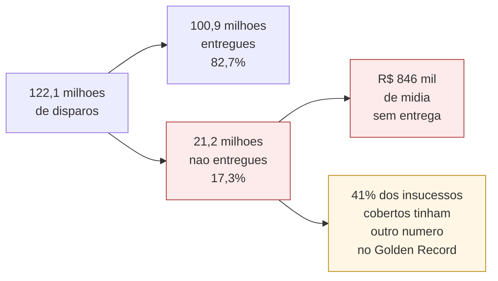

| Indicador | Valor | Linha |
|---|---|---|
| Disparos analisados | 122.050.718 | 1 |
| Taxa de entrega geral | 82,67% | 4 |
| Disparos que não chegam | 21.151.245 | 9 |
| Custo em disparos que não chegam | R$ 846.050 | 31 |
| Cobertura do Golden Record sobre disparos | 74,26% | 5 |
| Insucessos em que o Golden Record indicaria outro número | 40,68% | 8 |
| Parcela dos disparos em campanhas transacionais | 85,62% | 45 |

---

### Slide 2. O que está em jogo

**Título de ação**
Cada ponto de entrega vale R$ 973 mil nos briefings promocionais, e o canal está divergindo: sem o Golden Record a entrega cai, com ele sobe.

**Subtítulo de ação**
Os 21 briefings promocionais sustentam R$ 89,6 milhões de receita em oito meses. O canal transacional, sete vezes maior em volume, sustenta a experiência do cliente.

**Mensagem**

Os 21 briefings promocionais entregaram 15,6 milhões de SMS no período, que geraram cerca de 75 mil conversões e R$ 89,6 milhões de receita, a uma conversão efetiva de 0,48% e tíquete efetivo de R$ 1.188. Cada ponto de entrega nesses briefings vale R$ 973 mil.

A tendência agrava o quadro. Entre o primeiro e o oitavo mês, a entrega dos disparos que não usam o telefone do Golden Record caiu 2,4 pontos, enquanto a dos que usam subiu 2,3 pontos. A distância entre os dois caminhos abriu 4,7 pontos em oito meses. Sobre a régua de R$ 973 mil por ponto, é uma erosão em curso da ordem de R$ 4,5 milhões, que a decisão de hoje interrompe.

**Visual**

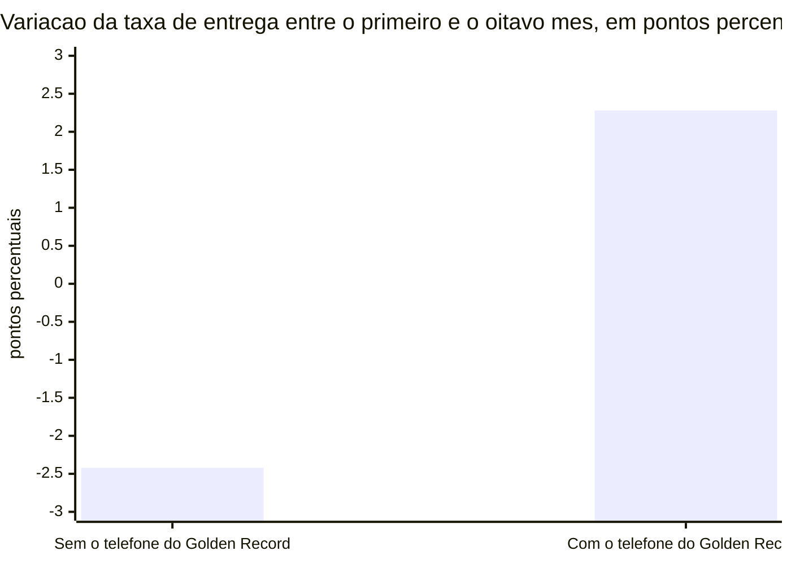

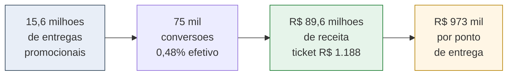

| Indicador | Valor | Linha |
|---|---|---|
| Entregas atuais nos briefings promocionais | 15.636.287 | 51 |
| Conversões estimadas hoje | 75.357 | 52 |
| Receita estimada hoje | R$ 89.555.504 | 53 |
| Taxa de conversão efetiva | 0,48% | 54 |
| Tíquete médio efetivo | R$ 1.188 | 55 |
| Valor de cada ponto percentual de entrega | R$ 973.492 | 78 |
| Variação da entrega sem o telefone recomendado | −2,42 p.p. | 101 |
| Variação da entrega com o telefone recomendado | +2,28 p.p. | 102 |

---

### Slide 3. O que o Golden Record faz

**Título de ação**
Com o telefone do Golden Record a entrega sobe de 74,8% para 89,8%: 15 pontos, e 30 pontos quando se compara o mesmo cliente.

**Subtítulo de ação**
O efeito aparece em 95% das campanhas, em todas as regiões, e supera em 14 pontos a melhor regra que o próprio CRM conseguiria aplicar sozinho.

**Mensagem**

A evidência vem da própria operação. Em 74% dos disparos o Golden Record tem opinião sobre o telefone. Em parte deles o CRM usou, por coincidência, exatamente esse número; em parte usou outro. Comparando os dois caminhos, o telefone do Golden Record entrega 89,8% contra 74,8%.

Quando a comparação é feita dentro do mesmo cliente, com os dois números acionados para a mesma pessoa, a diferença chega a 30 pontos. A razão de chances de entrega é de 2,9 vezes. O efeito não depende de uma campanha grande nem de uma região: vale em 95% das campanhas, em 100% das regiões testadas, sobrevive à exclusão da maior campanha e cresce para 18,7 pontos nos disparos em que a recomendação comprovadamente já existia antes do envio.

O ponto que fecha a discussão sobre alternativas: a melhor regra interna, usar o número mais acionado do cliente, entrega 75,6%. O Golden Record entrega 14 pontos a mais que ela.

**Visual**

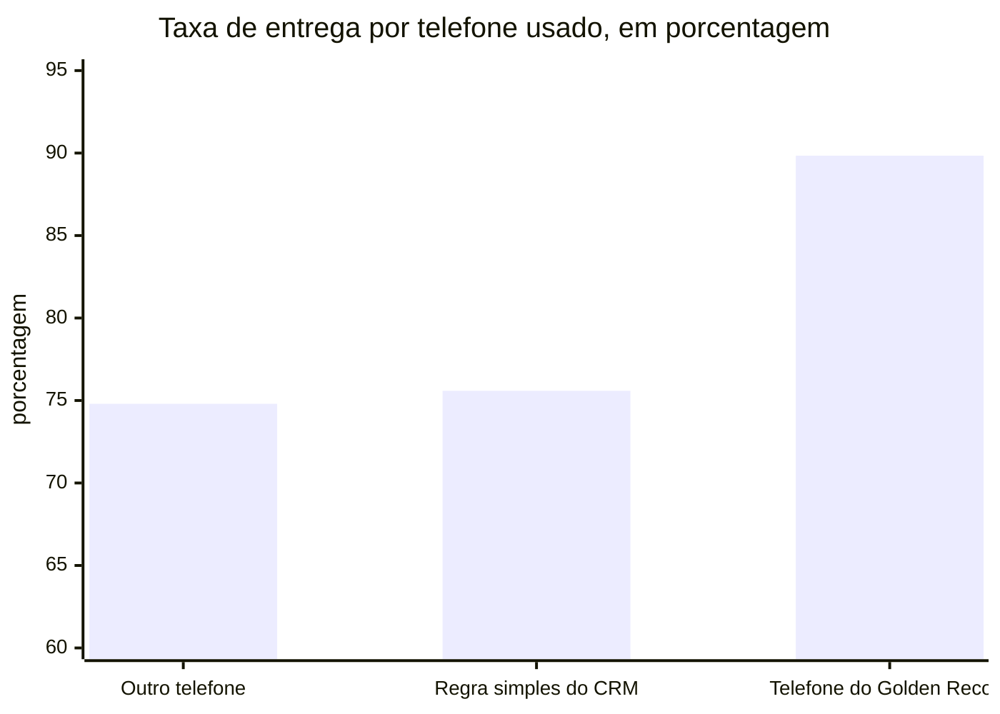

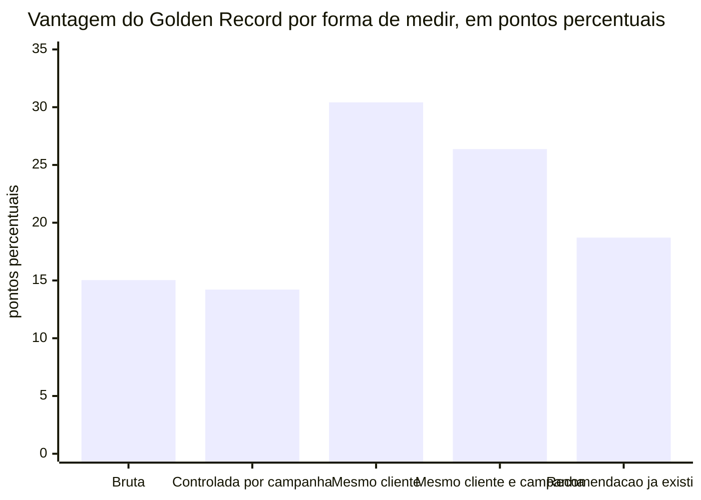

| Indicador | Valor | Linha |
|---|---|---|
| Entrega com telefone igual ao Golden Record | 89,84% | 10 |
| Entrega com telefone diferente | 74,80% | 11 |
| Diferença bruta | 15,03 p.p. | 12 |
| Diferença controlada por campanha | 14,21 p.p. | 13 |
| Razão de chances | 2,93 vezes | 14 |
| Diferença no mesmo cliente | 30,42 p.p. | 15 |
| Diferença no mesmo cliente e na mesma campanha | 26,37 p.p. | 16 |
| Entrega com a regra simples do CRM e ganho sobre ela | 75,59%; 14,25 p.p. | 17, 18 |
| Campanhas em que o Golden Record venceu | 94,80% | 20 |
| Regiões em que o Golden Record entrega mais | 100% | 28 |
| Efeito restrito aos disparos temporalmente válidos | 18,71 p.p. | 95 |

---

### Slide 4. O ganho físico

**Título de ação**
Adotar o Golden Record teria entregue 2,8 milhões de mensagens a mais em oito meses, sem um disparo adicional.

**Subtítulo de ação**
2,5 milhões em campanhas transacionais e 367 mil em promocionais. Nos promocionais, 89% dos candidatos são recuperados e só 9% das entregas atuais em risco se perdem.

**Mensagem**

O ganho é calculado com prudência. Para cada SMS que falhou num número diferente do recomendado, aplica-se a taxa de entrega que o telefone do Golden Record realmente teve naquela mesma campanha. E para cada SMS que hoje é entregue num número diferente, desconta-se a chance de o novo número não entregar. O saldo, líquido de perdas, é de 2,83 milhões de mensagens.

A maior parte, 2,46 milhões, está nas campanhas transacionais: avisos, códigos e confirmações que hoje não chegam e passariam a chegar. Essa parcela não tem preço de receita no estudo, e é justamente o argumento de experiência do cliente. Os 367 mil restantes estão nos briefings promocionais, e esses viram receita no próximo slide.

**Visual**

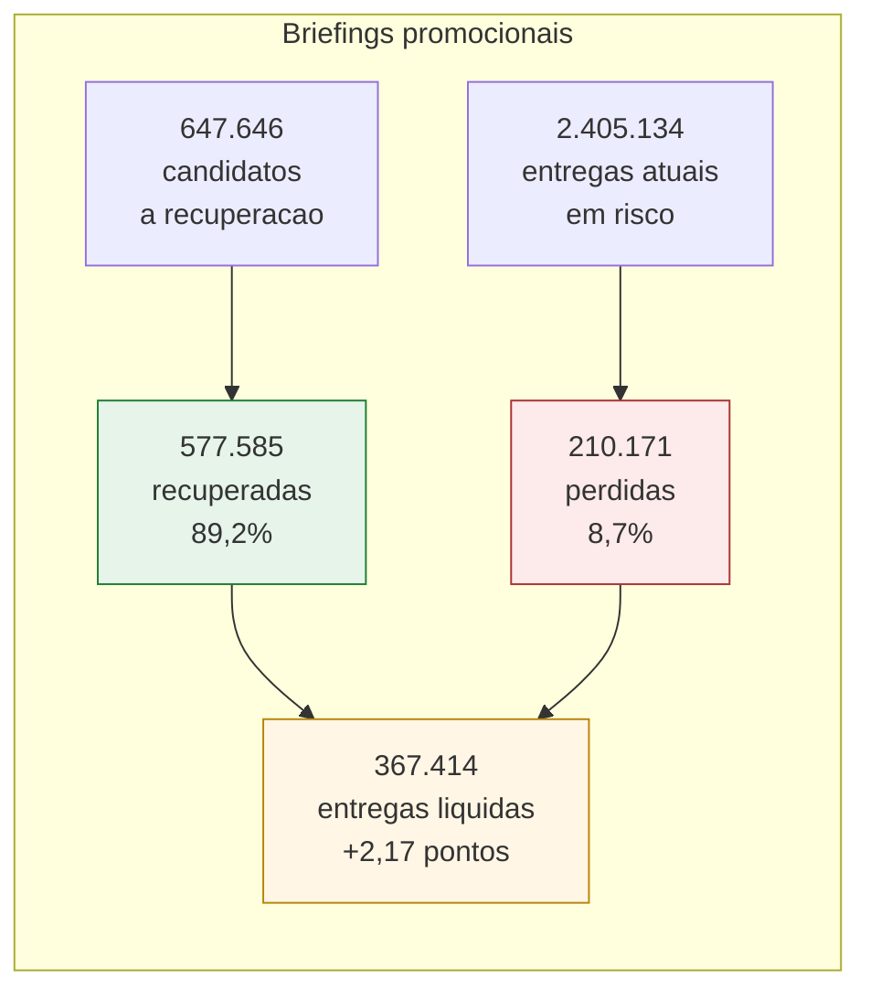

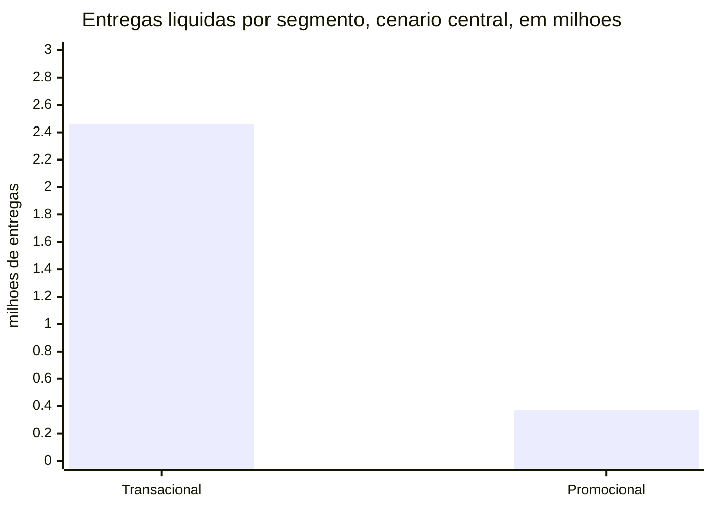

| Indicador | Valor | Linha |
|---|---|---|
| Entregas líquidas nas campanhas transacionais | 2.461.502 | 46 |
| Entregas líquidas nos briefings promocionais | 367.414 | 47, 60 |
| Candidatos a recuperação, promocionais | 647.646 | 56 |
| Entregas recuperadas | 577.585 | 57 |
| Entregas atuais em risco | 2.405.134 | 58 |
| Entregas perdidas | 210.171 | 59 |
| Lift na taxa de entrega, promocionais | 2,17 p.p. | 61 |

---

### Slide 5. Quanto vale

**Título de ação**
R$ 2,3 milhões de receita incremental em oito meses nos 21 briefings promocionais, R$ 3,5 milhões ao ano, sem nenhum briefing perdendo.

**Subtítulo de ação**
A faixa vai de R$ 167 mil no piso, que conta só o que já foi comprovado cliente a cliente, a R$ 3,9 milhões no teto. A incerteza da medição é de apenas R$ 2 mil.

**Mensagem**

Os 367 mil SMS promocionais a mais geram cerca de 2.100 conversões e R$ 2,33 milhões de receita no período, briefing a briefing, cada um com a própria conversão e o próprio tíquete. É um crescimento de 2,6% sobre a receita atual do canal, obtido sem um real a mais de mídia. Anualizado, R$ 3,49 milhões. Nenhum dos 21 briefings fica negativo, então a adoção pode ser geral.

Duas faixas cercam o número central. A de premissa vai de R$ 167 mil, cenário que só conta clientes em que o telefone recomendado já comprovou entregar, a R$ 3,87 milhões, cenário em que todo candidato viraria entrega. A faixa estatística, que mede quanto o acaso pode mover a taxa medida, tem R$ 2 mil de largura: com 122 milhões de disparos, a dúvida relevante é de premissa, não de dado. Se a conversão real for metade da informada, ainda são R$ 1,16 milhão; se for o dobro, R$ 4,65 milhões.

Há uma segunda régua, a de mídia, que vale para todas as campanhas: as 2,83 milhões de entregas a mais custariam R$ 137 mil se comprados em disparos adicionais. É pequena em reais porque o SMS custa quatro centavos, e é por isso que o valor do canal transacional deve ser lido em mensagens entregues, não em mídia.

**Visual**

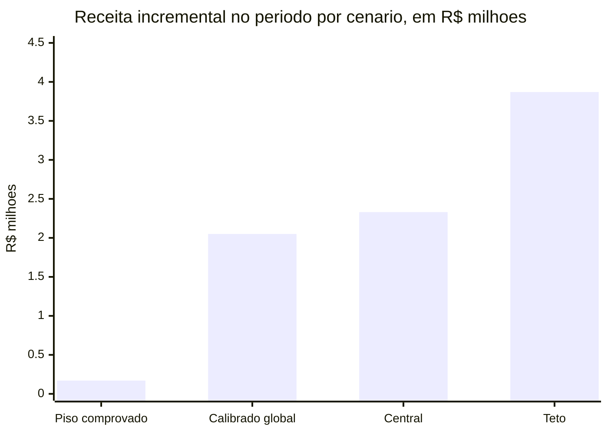

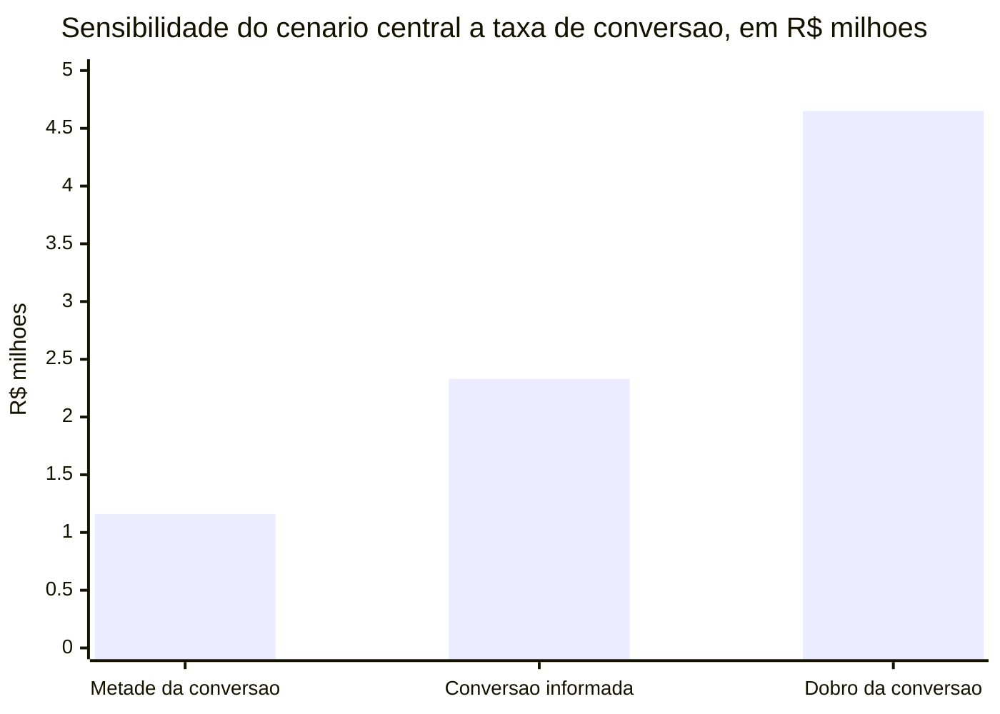

| Indicador | Valor | Linha |
|---|---|---|
| Conversões incrementais, central | 2.089 | 62 |
| Receita incremental no período, central | R$ 2.325.913 | 63 |
| Crescimento sobre a receita atual | 2,60% | 64 |
| Briefings em que o Golden Record reduziria a receita | 0 | 65 |
| Cenários teto, global, central, piso | R$ 3.870.881; 2.050.788; 2.325.913; 167.285 | 67, 68, 69, 71 |
| Sensibilidade, metade e dobro da conversão | R$ 1.162.956; R$ 4.651.825 | 74, 75 |
| Faixa estatística | R$ 2.049.529 a R$ 2.052.046 | 76, 77 |
| Receita incremental anualizada, central | R$ 3.488.869 | 79 |
| Valor equivalente em mídia, todas as campanhas, central | R$ 136.877 | 39 |

---

### Slide 6. Por que o valor medido é piso

**Título de ação**
O número central subestima o Golden Record por quatro razões, todas visíveis no dado.

**Subtítulo de ação**
Um quarto dos disparos ainda não tem cobertura, 90% dos candidatos nunca tiveram o telefone recomendado tentado, o efeito é maior onde a recomendação já existia, e a distância entre os dois caminhos cresce a cada mês.

**Mensagem**

Primeiro, o estudo só contabiliza ganho onde o Golden Record já tem um telefone: 74% dos disparos. O quarto restante fica de fora da conta e é a fronteira de crescimento do próprio Golden Record.

Segundo, 90% dos candidatos a recuperação nunca tiveram o telefone recomendado acionado. O cenário central aplica a eles a taxa medida na campanha, mas o piso de R$ 167 mil, que só conta o que foi comprovado cliente a cliente, mostra quanto do potencial ainda não foi sequer tentado.

Terceiro, nos 6% dos disparos em que a data prova que a recomendação já existia antes do envio, a vantagem é de 18,7 pontos, acima dos 15 pontos da base inteira. O dado mais limpo aponta um efeito maior, não menor.

Quarto, a tendência: em oito meses a entrega sem o Golden Record perdeu 2,4 pontos e a entrega com ele ganhou 2,3. O valuation é uma média de um período em que a vantagem cresceu. O ritmo atual é maior que a média.

**Visual**

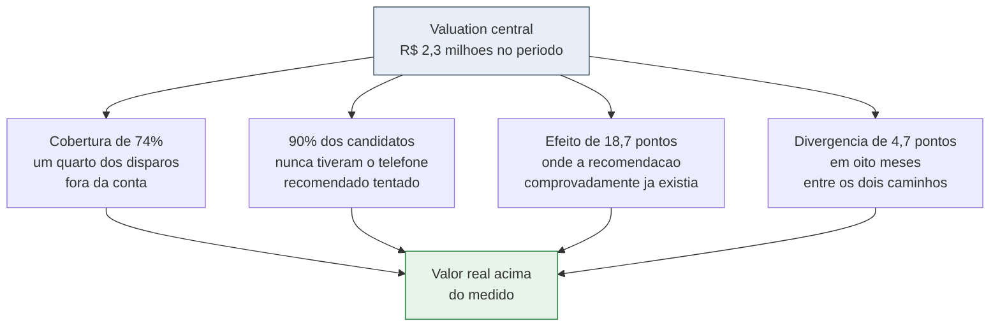

| Indicador | Valor | Linha |
|---|---|---|
| Cobertura do Golden Record sobre disparos | 74,26% | 5 |
| Candidatos sem histórico do telefone recomendado | 89,61% | 73 |
| Entrega do telefone recomendado onde ele já foi acionado | 85,32% | 72 |
| Disparos em que a recomendação já existia | 6,30% | 94 |
| Efeito restrito aos disparos temporalmente válidos | 18,71 p.p. | 95 |
| Variação da entrega sem e com o telefone recomendado | −2,42; +2,28 p.p. | 101, 102 |

---

### Slide 7. Além da receita: o ativo de cadastro

**Título de ação**
6,1 milhões de clientes não recebem nenhum SMS, e para 2,8 milhões deles o Golden Record tem um telefone que nunca foi tentado.

**Subtítulo de ação**
É um contato recuperável avaliado em R$ 14,6 milhões, e 194 mil clientes já têm o telefone comprovado, sem nenhum risco de perda.

**Mensagem**

O valuation mede o ganho sobre os disparos que aconteceram. Ele não captura o cliente que simplesmente não é alcançado. Entre os clientes cobertos pelo Golden Record, 6,1 milhões não receberam nenhum SMS em nenhum número durante os oito meses. Para 2,8 milhões deles o Golden Record aponta um telefone que o CRM nunca acionou.

Restabelecer esse contato não tem entrega atual a perder, porque não há entrega atual. Valorado à taxa de entrega do telefone recomendado e ao valor médio de uma entrega promocional, é um potencial de R$ 14,6 milhões. É a maior cifra do estudo, e é a que menos depende de premissa sobre troca de telefone: é contato que hoje não existe.

Há um subgrupo ainda mais seguro: 194 mil clientes em que o telefone recomendado já comprovou entregar para aquela mesma pessoa, enquanto o número usado falhou. Valem R$ 1,1 milhão e podem ser atualizados amanhã. No total, 7,1 milhões de cadastros têm telefone diferente do recomendado e são o escopo da atualização.

**Visual**

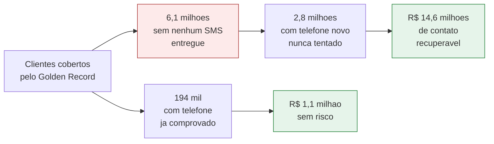

| Indicador | Valor | Linha |
|---|---|---|
| Clientes que não recebem SMS em nenhum número | 6.093.201 | 80 |
| Clientes inalcançáveis com telefone novo disponível | 2.834.411 | 81 |
| Clientes com telefone recomendado já comprovado | 193.659 | 82 |
| Valor do contato recuperável | R$ 14.583.760 | 83 |
| Valor do contato já comprovado | R$ 1.109.165 | 84 |
| Cadastros que precisariam ser atualizados | 7.135.493 | 85 |

---

### Slide 8. O que mais o dado revelou sobre a operação

**Título de ação**
Acionar o número errado custa 20% a mais por entrega, e 38% dos disparos são repetição: duas alavancas de custo que se somam ao Golden Record.

**Subtítulo de ação**
Onze campanhas concentram metade do ganho, o que permite começar pequeno e medir.

**Mensagem**

Cada entrega obtida com um telefone diferente do recomendado custa R$ 0,0535, contra R$ 0,0445 pelo telefone recomendado: 20% a mais. O Golden Record derruba o custo por entrega além de aumentar a receita, e o custo médio da operação cairia de R$ 0,0484 para R$ 0,0471 por entrega com o mesmo orçamento.

Independentemente do Golden Record, 38% do volume bruto de disparos são retentativas para o mesmo cliente, campanha e telefone. Retentativa é mídia paga sem novo alcance. Uma regra de deduplicação, ou de troca de número na retentativa em vez de repetição no mesmo, é a melhoria operacional de retorno mais imediato que o dado mostra.

O ganho é concentrado: 11 campanhas respondem por metade das entregas recuperadas e as 10 maiores por 49%. Isso define a estratégia de adoção: começar por elas captura muito valor com pouco esforço e permite medir antes de generalizar. A qualidade do dado de origem é integral: nenhum registro foi descartado.

**Visual**

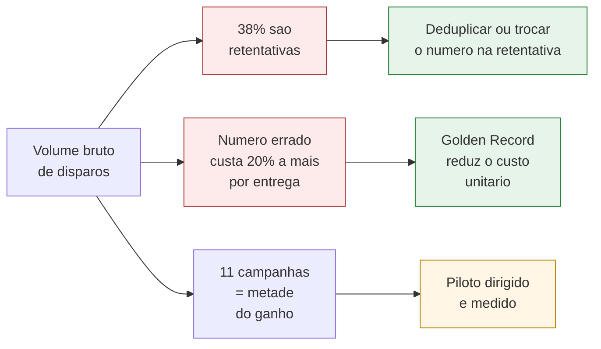

| Indicador | Valor | Linha |
|---|---|---|
| Custo por SMS entregue hoje | R$ 0,0484 | 32 |
| Custo por entrega com o telefone recomendado | R$ 0,0445 | 33 |
| Custo por entrega com outro telefone | R$ 0,0535 | 34 |
| Sobrecusto por entrega no número errado | R$ 0,0089 | 35 |
| Queda no custo por entrega, cenário central | R$ 0,0013 | 42 |
| Campanhas que concentram metade do ganho | 11 | 43 |
| Participação das dez maiores campanhas | 48,95% | 44 |
| Disparos que são repetição | 37,91% | 91 |
| Registros descartados | 0% | 90 |

---

### Slide 9. Próximos passos e decisão

**Título de ação**
Adotar em três ondas de risco crescente, medir na segunda, e levar a leitura de receita a toda a operação.

**Subtítulo de ação**
A primeira onda não tem entrega a perder. A segunda valida a premissa com dado próprio. A terceira generaliza.

**Mensagem**

Onda 1, imediata: os 2,8 milhões de clientes sem nenhuma entrega e com telefone novo, mais os 194 mil com telefone comprovado. Risco zero, porque não há entrega atual a perder, e potencial de R$ 14,6 milhões de contato recuperável.

Onda 2, em 30 dias: as 11 campanhas que concentram metade do ganho, com o Golden Record como telefone primário. Uma fatia mantém o telefone atual e serve de controle. É o piloto que transforma o valuation em resultado medido.

Onda 3, em 90 dias: toda a operação, transacional e promocional, condicionada ao piloto. Em paralelo, coletar conversão e tíquete dos demais briefings promocionais para que a leitura de receita, hoje restrita a 21 briefings, cubra o canal inteiro.

Três ações de operação e dado acompanham: tratar as retentativas, versionar o Golden Record para que cada recomendação tenha data e a validação temporal cubra mais que 6% dos disparos, e acompanhar mensalmente a vantagem do Golden Record, que já é medida e está crescendo.

**Visual**

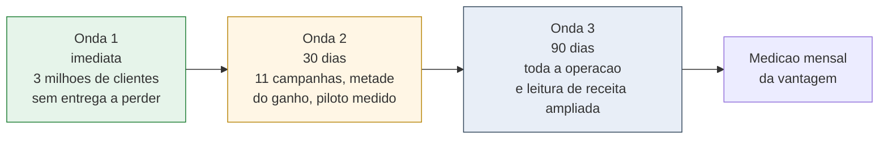

**Decisão solicitada**
Aprovar as ondas 1 e 2 agora, com a onda 3 condicionada ao piloto, e aprovar a coleta de conversão e tíquete dos demais briefings.

---

## Parte 3. Apêndice

### Fonte de cada número

| Número usado | Valor | Linha do relatório |
|---|---|---|
| Disparos, clientes e campanhas analisados | 122.050.718; 41.238.786; 1.683 | 1, 2, 3 |
| Taxa de entrega geral | 82,6701% | 4 |
| Cobertura do Golden Record sobre disparos e clientes | 74,2556%; 64,3791% | 5, 6 |
| Disparos e insucessos em que o Golden Record indicaria outro número | 21,6699%; 40,6811% | 7, 8 |
| Disparos que não chegam | 21.151.245 | 9 |
| Entrega com telefone igual e diferente do Golden Record | 89,8355%; 74,8025% | 10, 11 |
| Diferença bruta, controlada, razão de chances | 15,033 p.p.; 14,2127 p.p.; 2,9344 | 12, 13, 14 |
| Diferença no mesmo cliente, e na mesma campanha | 30,4183; 26,3659 p.p. | 15, 16 |
| Regra simples do CRM e ganho sobre ela | 75,585%; 14,2505 p.p. | 17, 18 |
| Efeito mediano, campanhas vencidas | 6,0019 p.p.; 94,8018% | 19, 20 |
| Robustez: sem a maior campanha, regra exata, com e sem cobertura | 13,3554; 14,3233; 15,1791 p.p. | 21, 22, 23 |
| Faixas de porte e de intensidade, regiões | 7,56 a 20,15 p.p.; 1,32 a 35,52 p.p.; 100% | 24 a 28 |
| Custo total e custo sem entrega | R$ 4.882.028,72; R$ 846.049,80 | 30, 31 |
| Custo por entrega: geral, recomendado, outro, sobrecusto | R$ 0,048385; 0,044526; 0,053474; 0,008948 | 32 a 35 |
| Valor em mídia: teto, global, central, estresse, piso | R$ 239.439; 142.851; 136.877; 22.547; 7.732 | 37 a 41 |
| Queda no custo por entrega | R$ 0,00132 | 42 |
| Campanhas para metade do ganho, dez maiores | 11; 48,9477% | 43, 44 |
| Parcela transacional dos disparos | 85,6205% | 45 |
| Entregas líquidas transacionais e promocionais | 2.461.502; 367.414 | 46, 47 |
| Custo em disparos transacionais sem entrega, mídia transacional | R$ 769.489,04; R$ 119.099,96 | 48, 49 |
| Briefings promocionais | 21 | 50 |
| Entregas, conversões, receita atual promocional | 15.636.287; 75.356,7; R$ 89.555.504,11 | 51, 52, 53 |
| Conversão e tíquete efetivos | 0,4819%; R$ 1.188,42 | 54, 55 |
| Candidatos, recuperadas, em risco, perdidas, líquidas | 647.646; 577.585; 2.405.134; 210.171; 367.414 | 56 a 60 |
| Lift, conversões incrementais | 2,1691 p.p.; 2.089 | 61, 62 |
| Receita incremental central, crescimento, briefings negativos | R$ 2.325.912,53; 2,5972%; 0 | 63, 64, 65 |
| Cenários teto, global, central, estresse, piso | R$ 3.870.880,91; 2.050.787,82; 2.325.912,53; −180.003,32; 167.285,43 | 67 a 71 |
| Taxa do telefone recomendado onde já acionado, candidatos sem histórico | 85,3214%; 89,6082% | 72, 73 |
| Sensibilidade, metade e dobro | R$ 1.162.956,27; R$ 4.651.825,07 | 74, 75 |
| Faixa estatística | R$ 2.049.528,73 a 2.052.046,13 | 76, 77 |
| Valor de cada ponto percentual | R$ 973.492,33 | 78 |
| Receita incremental anualizada | R$ 3.488.868,80 | 79 |
| Clientes sem entrega, com telefone novo, comprovados | 6.093.201; 2.834.411; 193.659 | 80, 81, 82 |
| Valor do contato recuperável e comprovado | R$ 14.583.759,83; R$ 1.109.165,45 | 83, 84 |
| Cadastros a atualizar | 7.135.493 | 85 |
| Registros descartados, disparos repetidos | 0%; 37,9075% | 90, 91 |
| Janela coberta | 243 dias, 8 meses | 93, 100 |
| Recomendação já existia, efeito nos válidos | 6,2962%; 18,7055 p.p. | 94, 95 |
| Variação da entrega sem e com o telefone recomendado | −2,4227; +2,277 p.p. | 101, 102 |

### Premissas das projeções

**Receita anualizada, R$ 3,49 milhões.** Linha 79 do relatório: receita central do período dividida por 8 meses com registro e multiplicada por 12. Assume que o ritmo de disparos e o efeito se repetem no restante do ano, sem sazonalidade. É o único número anualizado do material.

**Erosão da ordem de R$ 4,5 milhões.** Soma das variações das linhas 101 e 102, 4,7 pontos de divergência entre os dois caminhos em oito meses, multiplicada pela régua de R$ 973 mil por ponto da linha 78. Assume que a divergência observada entre os braços se traduziria integralmente em perda de entrega na base promocional. É uma projeção de risco para dimensionar o que a decisão protege, não uma previsão.

**Sobrecusto de 20%.** Razão entre as linhas 34 e 33, menos um.

**Redução de 2,7% no custo por entrega.** Linha 42 dividida pela linha 32.

### Consistência interna verificada

O lift de 2,17 pontos multiplicado pelo valor de R$ 973 mil por ponto reproduz R$ 2,11 milhões, contra R$ 2,33 milhões da receita incremental calculada briefing a briefing. A diferença vem da ponderação por briefing: o ganho se concentra em briefings de economia acima da média. As entregas líquidas transacionais e promocionais, linhas 46 e 47, somam 2.828.916, que multiplicadas pelo custo por entrega de R$ 0,048385 reproduzem os R$ 136.877 da linha 39. A linha 47 é idêntica à linha 60. A faixa estatística das linhas 76 e 77 tem como centro a linha 68, como deve.

### Ressalvas de dado a tratar antes de uma versão final

1. O cenário de estresse fica negativo na régua de receita, −R$ 180 mil, e positivo na régua de mídia, +R$ 22,5 mil. Não é contradição: a régua de mídia olha todas as campanhas e a de receita só os briefings promocionais, e nos promocionais o subgrupo com histórico é mais difícil. O cenário descreve esse subgrupo, que responde por 10% dos candidatos, e não o desempenho esperado. O material o cita apenas no apêndice.

2. A validação temporal cobre 6,3% dos disparos, porque a maior parte das recomendações do Golden Record foi carregada depois dos disparos. Nesse subconjunto o efeito é maior, 18,7 pontos. Versionar o Golden Record permitiria validar toda a base.

3. A linha 92, vantagem da carga recente sobre a antiga, veio nula: a carga do Golden Record não tem registros com mais de doze meses nesta versão. Não afeta nenhum número do material.

4. As linhas 103 a 108 do bloco de evolução mensal não constam das fotos desta execução. O material usa apenas as linhas 101 e 102 para a tendência. A vantagem no primeiro e no último mês e a inclinação mensal devem entrar na versão final.

5. O valor do contato recuperável, R$ 14,6 milhões, assume uma entrega por cliente valorada pela economia média dos briefings promocionais. É potencial, não previsão, e depende de esses clientes serem elegíveis a campanhas promocionais.

### Notas de montagem

Os títulos de ação, lidos em sequência, contam a história: um em cada cinco SMS não chega; cada ponto vale R$ 973 mil e o canal está divergindo; o Golden Record entrega 15 pontos a mais e vence em 95% das campanhas; isso são 2,8 milhões de mensagens a mais sem disparo adicional; nos promocionais vale R$ 2,3 milhões no período sem nenhum briefing perdendo; o valor medido é piso; há 2,8 milhões de clientes inalcançáveis com telefone novo; o dado revelou mais duas alavancas de custo; e há um caminho de adoção em três ondas.

Os gráficos foram descritos em mermaid para visualização rápida. Para o PowerPoint, reconstrua a partir das tabelas de dados que acompanham cada visual. Os diagramas de fluxo funcionam como infográficos de setas; os de barras devem virar gráficos nativos.

O material evita métodos. Se o board perguntar como o efeito foi medido, a resposta curta é: comparando o mesmo cliente consigo mesmo e a mesma campanha consigo mesma, quando o CRM por coincidência usou o telefone do Golden Record e quando não usou. Se perguntar por que a receita cobre só 21 briefings, a resposta é: são os únicos com conversão e tíquete informados; o ganho físico do restante está medido, em 2,5 milhões de mensagens, e vira receita assim que a economia desses briefings for informada.
